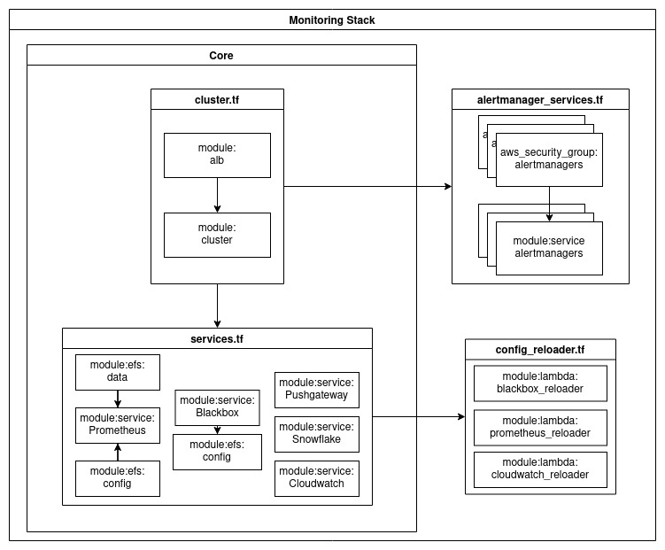
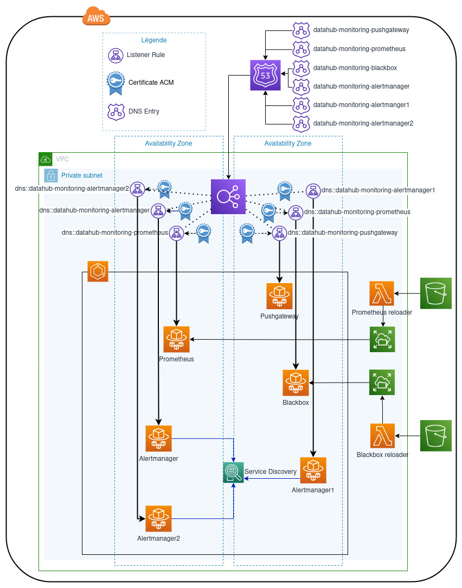
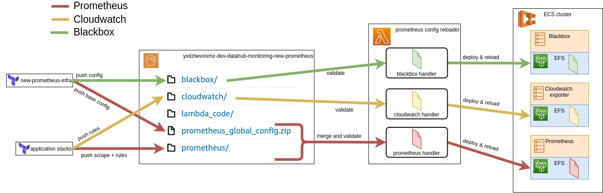

# Monitoring Infrastructure for Datahub

## Table of content 

- [Features](#features)
- [Architecture](#architecture)
    - [Terraform](#terraform)
    - [Infrastructure](#infrastructure)
- [Configuration](#configuration)
    - [Prometheus](#prometheus)
    - [Cloudwatch Exporter](#cloudwatch-exporter)
    - [Blackbox Exporter](#blackbox-exporter)
- [Implementation details](#implementation-details)
- [What's next](#whats-next)


## Features

- Basic ECS Features
    - Fargate 1.4.0
    - Access logs on ALB
    - Each service register to service discovery, define dns entry + ALB Route + SSL Certificate
    - Logs available to debug Tasks
- Clusterized Alertmanager (HA)
- Config reloader for Prometheus, Cloudwatch exporter and Blackbox reporter (see [Configuration](#configuration))
    - Based on a single s3 bucket (projects push their scrape and rules configuration into it)
    - Prometheus configuration is generated by merging all configuration files into 1
    - Final configuration is deployed only when validation tests are green

## Architecture

### Terraform

Main code segmentation

  - cluster: create an ECS Cluster with its load balancer and certificates
  - services: create ECS services + task definitions on the cluster with ACM certificate and service discovery necessary for inter service communications
  - efs_volumes: create EFS volumes for ECS tasks
  - config_deployment: deploys blackbox and prometheus base config files to s3 
  - config_reloader_lambdas: setup lambdas triggered on s3 put events for the reloading of prometheus; blackbox and cloudwatch exporter config.
  - pushgateway garbage collection: setup a scheduled task to garbage collect metrics on push gateway service 

Resources for Snowflake Exporter have been gathered into a dedicated module as snowflake is not used on all our environments.

See [terraform-docs](./tfdocs.md) for details



### Infrastructure



## Configuration



Applications directly push their configuration files on the s3 bucket dedicated to this infra :

  - Prometheus scrape and alert rules (through [monitoring-config-generator](https://gitlab.eulerhermes.com/deployment/datahub/terraform-modules/monitoring-config-generator) or [prometheus-config-generator](https://gitlab.eulerhermes.com/deployment/datahub/terraform-modules/prometheus-config-generator) (deprecated) terraform modules)
  - Cloudwatch exporter metric definitions (through [monitoring-config-generator](https://gitlab.eulerhermes.com/deployment/datahub/terraform-modules/monitoring-config-generator) or [cloudwatch-exporter-config-generator](https://gitlab.eulerhermes.com/cloud-devops/terraform-modules/cloudwatch-exporter-config-generator) (deprecated) terraform module)

Configuration generation, validation and reload is handled by [prometheus_config_reloader](https://gitlab.eulerhermes.com/deployment/datahub/devops/prometheus/prometheus_config_reloader) running in a lambda triggered by s3 `PUT` events. Documentation on how to configure this tool is accessible [here](https://gitlab.eulerhermes.com/deployment/datahub/devops/prometheus/prometheus_config_reloader/-/blob/master/README.md).

### Prometheus

This stack deploys a file - defined as a template - to s3 that serves as a base config file for Prometheus. `prometheus_config_reloader` collects and merge it with all the scrape and rules configuration files deployed by the apps in order to build the final prometheus configuration file that is really deployed to prometheus FS.

`prometheus_config_reloader` allow using placeholders on prometheus config file. See [availaible values](https://gitlab.eulerhermes.com/deployment/datahub/devops/prometheus/prometheus_config_reloader/-/blob/master/README.md#template-placeholders) 

<details><summary>Exemple file</summary>

```yaml
# prometheus global config
global:
  scrape_interval:     1m # Set the scrape interval to every 1 minute. Default was 15 seconds.
  evaluation_interval: 1m # Evaluate rules every 1 minute. The default is every 15 seconds.
  # scrape_timeout is set to the global default (10s).

# Load rules once and periodically evaluate them according to the global 'evaluation_interval'.
rule_files:
  - 'rules/*.yml'

# Alertmanager configuration
alerting:
  alertmanagers:
    - static_configs:
        - targets:
            - ALERTMANAGER_URL_1 # Replaced by prometheus_config_reloader 
            - ALERTMANAGER_URL_2 # Replaced by prometheus_config_reloader
            - ALERTMANAGER_URL_3 # Replaced by prometheus_config_reloader
      scheme: https

scrape_configs:
- job_name: prometheus
  honor_timestamps: true
  scrape_interval: 15s
  scrape_timeout: 10s
  metrics_path: /metrics
  scheme: http
  static_configs:
  - targets:
    - localhost:9099
- job_name: pushgateway
  honor_labels: true
  scrape_interval: 10s
  scheme: https
  static_configs:
    - targets: ['PUSHGATEWAY_URL'] # Replaced by prometheus_config_reloader
      labels:
        group: 'lambdas'
  metric_relabel_configs:
  - action: labeldrop
    regex: log_group
  - action: labeldrop
    regex: log_stream
- job_name: cloudwatch
  scheme: https
  scrape_interval: 5m
  scrape_timeout: 5m
  metrics_path: "/metrics"
  static_configs:
  - targets:
      - CLOUDWATCH_URL # Replaced by prometheus_config_reloader
- job_name: blackbox
  metrics_path: /probe
  params:
    module: [http_2xx]
  scheme: https
  static_configs:
    - targets: []
  relabel_configs:
    - source_labels: [__address__]
      target_label: __param_target
    - source_labels: [__param_target]
      target_label: instance
    - target_label: __address__
      replacement: BLACKBOX_URL # Replaced by prometheus_config_reloader
- job_name: snowflake
  scrape_interval: 30m
  scrape_timeout: 5m
  metrics_path: "/metrics"
  scheme: https
  static_configs:
    - targets:
        - SNOWFLAKE_URL # Replaced by prometheus_config_reloader
- job_name: alertmanager
  scrape_interval: 1m
  scrape_timeout: 30s
  metrics_path: "/metrics"
  scheme: https
  static_configs:
    - targets:
        - ALERTMANAGER_URL_1 # Replaced by prometheus_config_reloader
        - ALERTMANAGER_URL_2 # Replaced by prometheus_config_reloader
        - ALERTMANAGER_URL_3 # Replaced by prometheus_config_reloader
```

</details>

### Blackbox exporter

This stack also deploys the Blackbox configuration file - defined as a template - to s3. `prometheus_config_reloader` then validate, deploys to EFS and calls the reload endpoint.

### Cloudwatch exporter

Rules are pushed by applications to s3. `prometheus_config_reloader` pushes to EFS and calls the reload endpoint


## Implementation details

see [Implementation Details page](implementation-details.md)

## What's next

- implement on BE and Core
- configure prometheus to use service discovery hostname of exporters
- standardize CI/CD pipeline for application code (for reloader code)
- on reloader: change algo to reject only the proometheus configuration that cause problem (not all the merged configuration)
- add notification system for the reloader check failure
- implement DR on this project
- multi-region
- Implement App Mesh to have end-to-end encryption between services and alb
- long term storage (Thanos or AMP) automatic configuration of metrics and potentially alerts  (avoid the instanciation of a Terraform "monitoring" module in each project to generate configuration)
- find a way to generate images (jpg and svg) for documentation purpose, based on a draw.io (considered as source of truth)
